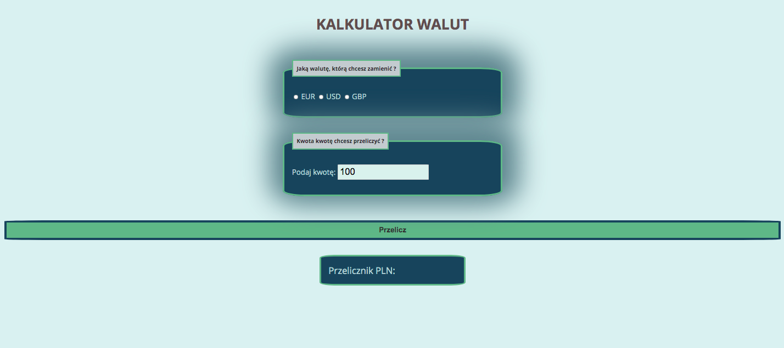

# Currency Coverter for YouCode project

## Table of content: 
* [ Preview the converter](#currency-converter)
* [ Basic Information ](#basic-information) 
* [ Used Technologies](#used-technologies)
* [Usage](#usage)

## Preview the coverter

[ Lets go to currency converter](https://meggcreative.github.io/currencyExchange/)

## Basic Information

This project was created to make a simple example of using forms in JS. This currency converter shows how many PLN we can have if we have some amount of currency: EUR/USD/GBP.

## Used Technologies
1. Semantic HTML
2. CSS
3. BEM convenction
4. ES6 features

## Usage
1. Choose currency which You want to covert to PLN
2. Enter Your amount 
3. Press button "Przelicz"
4. The Final converted amount You will get on the bottom of page

