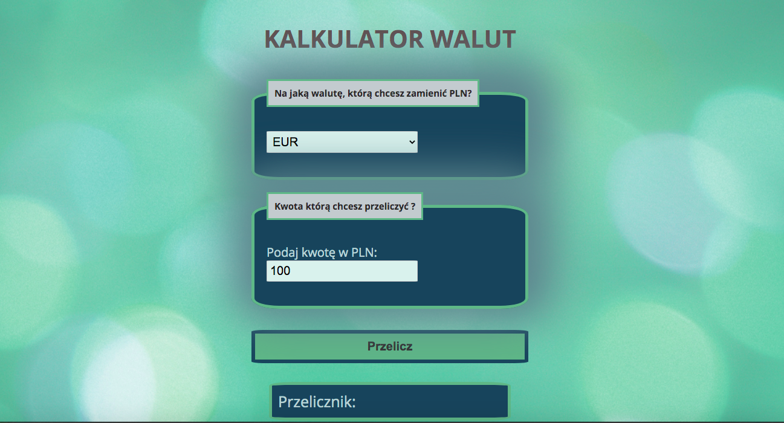

# Currency Converter for YouCode project

## Table of content: 
* [ Preview the converter](#currency-converter)
* [ Basic Information ](#basic-information) 
* [ Used Technologies](#used-technologies)
* [Usage](#usage)

## Preview the coverter

[ Lets go to currency converter](https://meggcreative.github.io/currencyExchange/)

## Basic Informations

This project was created to make a simple example of using forms in JS. This currency converter shows which amount we will get and how much if we want to change PLN for it. Currency to pick: EUR/USD/GBP.

## Used Technologies
1. Semantic HTML
2. CSS
3. BEM convenction
4. ES6+ 

## Usage
1. Choose currency which You want to be convert from PLN
2. Enter Your amount in PLN
3. Press button "Przelicz"
4. The Final converted amount You will get on the bottom of page

